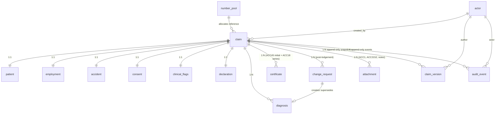

# ACC Claim Console — Database Schema

An appropriate, production-oriented schema for the claims behind the dashboard. It is
**PostgreSQL**-flavoured but portable. It is the durable form of the `persistence`
connector (see `AS-BUILT-SPEC.md` §14) and encodes the requirement that **every saved
instance is versioned and attributed to its author**, with an append-only audit trail
surfaced on the Audit → Inspect view.

## Design principles

1. **One claim aggregate, normalized.** A `claim` root with 1:1 satellite tables for the
   ACC45 parts (patient, employment, accident, consent, flags, declaration) and 1:N tables
   for repeating items (diagnoses, certificates, change requests, attachments). This keeps
   validation and querying relational rather than a single wide row or opaque JSON blob.
2. **Identity is referenced, not owned.** NHI (patient) and HPI (practitioner/facility) are
   master data in national services (Digital Services Hub). Store the **identifier** plus a
   **captured snapshot** of what was used on the claim; refresh from source just-in-time.
   Never treat this DB as the source of truth for identity.
3. **Attribution everywhere.** Every mutating row carries a `*_by` actor FK; every save
   writes a `claim_version` (attributed snapshot) and an `audit_event`.
4. **Append-only history.** `claim_version` and `audit_event` are **immutable** — no
   `UPDATE`/`DELETE`. Records are legal documents; correct via new versions/statuses, never
   destructive edits or hard deletes.
5. **Derived, not stored, time windows.** The 14-day repair window is computed from
   `lodged_on`; the 12-month lodgement horizon from `accident.occurred_at`. Don't persist
   countdowns.
6. **NZ data residency & least privilege.** Host in an approved NZ region; encrypt at rest;
   row-level security for sensitive claims; app connects as a role that **cannot** update or
   delete the history tables.

## Entity–relationship overview



## DDL (PostgreSQL)

```sql
-- ---------- enumerated types ----------
CREATE TYPE claim_status     AS ENUM ('draft','ready','lodged','accepted','held','declined');
CREATE TYPE diagnosis_status AS ENUM ('draft','lodged','accepted','declined','change_pending','superseded');
CREATE TYPE work_capacity    AS ENUM ('fully_fit','selected_work','fully_unfit');
CREATE TYPE cert_type        AS ENUM ('acc45_initial','acc18');
CREATE TYPE body_side        AS ENUM ('left','right','bilateral','na');
CREATE TYPE number_source    AS ENUM ('acc_allocation_api','preallocated_block');
CREATE TYPE change_kind      AS ENUM ('add','change','correct');
CREATE TYPE change_status    AS ENUM ('submitted','accepted','held','declined');
CREATE TYPE actor_role       AS ENUM ('clerical','clinical','audit','system');
CREATE TYPE claim_type       AS ENUM ('injury','treatment_injury','gradual_process','sensitive','maternal_birth');

-- ---------- actors (workforce identity for attribution) ----------
-- Identity is federated (My Health Account Workforce / HPI); this table caches the
-- attributes needed for attribution and access control.
CREATE TABLE actor (
    actor_id      uuid PRIMARY KEY DEFAULT gen_random_uuid(),
    workforce_sub text UNIQUE,              -- OIDC subject (My Health Account Workforce)
    hpi_cpn       text,                     -- HPI Common Person Number (clinicians)
    display_name  text NOT NULL,
    default_role  actor_role NOT NULL,
    active        boolean NOT NULL DEFAULT true,
    created_at    timestamptz NOT NULL DEFAULT now()
);

-- ---------- ACC45 number allocation (block mode) ----------
CREATE TABLE number_pool (
    pool_id      uuid PRIMARY KEY DEFAULT gen_random_uuid(),
    provider_id  text NOT NULL,
    range_start  text NOT NULL,
    range_end    text NOT NULL,
    next_unused  text NOT NULL,
    remaining    integer NOT NULL,
    low_watermark integer NOT NULL DEFAULT 20
);

-- ---------- claim root ----------
CREATE TABLE claim (
    claim_id       uuid PRIMARY KEY DEFAULT gen_random_uuid(),
    reference      text UNIQUE NOT NULL,           -- ACC45 number, opaque string
    number_source  number_source NOT NULL,
    claim_type     claim_type NOT NULL DEFAULT 'injury',
    status         claim_status NOT NULL DEFAULT 'draft',
    decision       text,                           -- Received/Accepted/Held/Declined
    -- encounter (from PMS/PAS SMART launch) — references, not master data
    encounter_external_id  text,
    encounter_source_system text,
    facility_hpi           text,                   -- HPI Organisation/Location
    attending_provider_hpi text,                   -- HPI Practitioner
    created_at     timestamptz NOT NULL DEFAULT now(),
    created_by     uuid NOT NULL REFERENCES actor(actor_id),
    lodged_on      date,                           -- anchors the 14-day repair window
    lodged_by      uuid REFERENCES actor(actor_id),
    updated_at     timestamptz NOT NULL DEFAULT now()
);
CREATE INDEX ix_claim_status      ON claim(status);
CREATE INDEX ix_claim_lodged_on   ON claim(lodged_on);
CREATE INDEX ix_claim_created_by  ON claim(created_by);

-- ---------- Part A: patient (captured snapshot; NHI is master elsewhere) ----------
CREATE TABLE patient (
    claim_id      uuid PRIMARY KEY REFERENCES claim(claim_id) ON DELETE CASCADE,
    nhi           text,                            -- validated via NHI service
    pas_patient_id text,
    given_name    text,
    family_name   text,
    dob           date,
    sex           text,
    ethnicity     text,
    mobile        text,
    email         text,
    residential_address text,
    postal_address text
);
CREATE INDEX ix_patient_nhi ON patient(nhi);
-- name search for the audit dashboard (trigram)
CREATE EXTENSION IF NOT EXISTS pg_trgm;
CREATE INDEX ix_patient_name_trgm ON patient USING gin ((coalesce(given_name,'')||' '||coalesce(family_name,'')) gin_trgm_ops);

-- ---------- Part B: employment ----------
CREATE TABLE employment (
    claim_id          uuid PRIMARY KEY REFERENCES claim(claim_id) ON DELETE CASCADE,
    status            text NOT NULL,               -- Not employed in NZ / Employee / ...
    occupation        text,
    employer_name     text,
    employer_address  text,
    employer_contact  text,
    accredited_employer boolean NOT NULL DEFAULT false
);

-- ---------- Part B: accident ----------
CREATE TABLE accident (
    claim_id       uuid PRIMARY KEY REFERENCES claim(claim_id) ON DELETE CASCADE,
    occurred_at    timestamptz,                    -- date + time of accident
    country        text NOT NULL DEFAULT 'New Zealand',
    location       text,
    scene          text,                           -- Home/Work/Road/...
    workplace      boolean NOT NULL DEFAULT false,
    moving_vehicle boolean NOT NULL DEFAULT false,
    sporting       boolean NOT NULL DEFAULT false,
    sport          text,                           -- required when sporting = true
    cause          text,
    triage_narrative text,
    CONSTRAINT sport_required_when_sporting CHECK (NOT sporting OR sport IS NOT NULL)
);

-- ---------- Part E (patient): consent ----------
CREATE TABLE consent (
    claim_id          uuid PRIMARY KEY REFERENCES claim(claim_id) ON DELETE CASCADE,
    collection_auth   boolean NOT NULL DEFAULT false,
    truth_declaration boolean NOT NULL DEFAULT false,
    lodge_auth        boolean NOT NULL DEFAULT false,
    captured_at       timestamptz,
    captured_by       uuid REFERENCES actor(actor_id),
    representative_name text,
    representative_relationship text,
    given             boolean GENERATED ALWAYS AS (collection_auth AND truth_declaration AND lodge_auth) STORED
);

-- ---------- Part C: diagnoses ----------
CREATE TABLE diagnosis (
    diagnosis_id  uuid PRIMARY KEY DEFAULT gen_random_uuid(),
    claim_id      uuid NOT NULL REFERENCES claim(claim_id) ON DELETE CASCADE,
    code          text NOT NULL,
    code_system   text NOT NULL DEFAULT 'http://snomed.info/sct',  -- SNOMED | READ | ICD10
    display       text,
    body_site     text,
    side          body_side NOT NULL DEFAULT 'na',
    acc_eligible  boolean NOT NULL,                -- member of acc-claim-reference-set
    is_primary    boolean NOT NULL DEFAULT false,
    status        diagnosis_status NOT NULL DEFAULT 'draft',
    source_change_request_id uuid,                 -- FK added after change_request exists
    supersedes_diagnosis_id  uuid REFERENCES diagnosis(diagnosis_id),
    created_at    timestamptz NOT NULL DEFAULT now(),
    created_by    uuid REFERENCES actor(actor_id)
);
CREATE INDEX ix_diagnosis_claim ON diagnosis(claim_id);
-- exactly one primary per claim
CREATE UNIQUE INDEX ux_diagnosis_primary ON diagnosis(claim_id) WHERE is_primary;

-- ---------- Part C: clinical flags ----------
CREATE TABLE clinical_flags (
    claim_id        uuid PRIMARY KEY REFERENCES claim(claim_id) ON DELETE CASCADE,
    gradual_process boolean NOT NULL DEFAULT false,
    treatment_injury boolean NOT NULL DEFAULT false,
    admitted        boolean NOT NULL DEFAULT false,
    home_assistance boolean NOT NULL DEFAULT false,
    rehab_requested boolean NOT NULL DEFAULT false
);

-- ---------- Part D / ACC18: certificates (initial + ongoing series) ----------
CREATE TABLE certificate (
    certificate_id uuid PRIMARY KEY DEFAULT gen_random_uuid(),
    claim_id       uuid NOT NULL REFERENCES claim(claim_id) ON DELETE CASCADE,
    cert_type      cert_type NOT NULL,
    work_exertion  text,
    capacity       work_capacity,
    restrictions   text,
    justification  text,
    valid_from     date,
    valid_to       date,
    issued_at      timestamptz NOT NULL DEFAULT now(),
    issued_by      uuid REFERENCES actor(actor_id),
    CONSTRAINT restrictions_required CHECK (capacity <> 'selected_work' OR restrictions IS NOT NULL),
    CONSTRAINT justification_required CHECK (capacity <> 'fully_unfit'  OR justification IS NOT NULL)
);
CREATE INDEX ix_certificate_claim ON certificate(claim_id);

-- ---------- Part E (practitioner): declaration ----------
CREATE TABLE declaration (
    claim_id        uuid PRIMARY KEY REFERENCES claim(claim_id) ON DELETE CASCADE,
    made            boolean NOT NULL DEFAULT false,
    declaration_date date,
    signed_by       uuid REFERENCES actor(actor_id),
    provider_number text                            -- HPI provider/locum number
);

-- ---------- Post-lodgement change requests (ACC32 family) ----------
CREATE TABLE change_request (
    change_request_id uuid PRIMARY KEY DEFAULT gen_random_uuid(),
    claim_id          uuid NOT NULL REFERENCES claim(claim_id) ON DELETE CASCADE,
    kind              change_kind NOT NULL,
    target_diagnosis_id uuid REFERENCES diagnosis(diagnosis_id),
    code              text,
    code_system       text,
    display           text,
    body_site         text,
    side              body_side,
    accident_date     date,                         -- copied from claim (read-only)
    same_event_confirmed boolean NOT NULL DEFAULT false,
    reason            text,
    bundled_certificate_id uuid REFERENCES certificate(certificate_id),
    transport         text,                         -- change_in_diagnosis | ACC32 | correction
    status            change_status NOT NULL DEFAULT 'submitted',
    requested_at      timestamptz NOT NULL DEFAULT now(),
    requested_by      uuid REFERENCES actor(actor_id),
    decided_at        timestamptz
);
CREATE INDEX ix_change_request_claim ON change_request(claim_id);
ALTER TABLE diagnosis
    ADD CONSTRAINT fk_diagnosis_source_cr
    FOREIGN KEY (source_change_request_id) REFERENCES change_request(change_request_id);

-- ---------- Attachments (ACC1, ACC2152, patient notes) ----------
CREATE TABLE attachment (
    attachment_id uuid PRIMARY KEY DEFAULT gen_random_uuid(),
    claim_id      uuid NOT NULL REFERENCES claim(claim_id) ON DELETE CASCADE,
    kind          text NOT NULL,                    -- ACC1 | ACC2152 | patient_notes | other
    file_ref      text NOT NULL,                    -- object-store key (not the blob)
    uploaded_at   timestamptz NOT NULL DEFAULT now(),
    uploaded_by   uuid REFERENCES actor(actor_id)
);

-- ================= HISTORY (append-only, immutable) =================

-- Point-in-time snapshot of the whole claim aggregate, one row per save, attributed.
CREATE TABLE claim_version (
    claim_id    uuid NOT NULL REFERENCES claim(claim_id),
    version     integer NOT NULL,
    created_at  timestamptz NOT NULL DEFAULT now(),
    author_id   uuid NOT NULL REFERENCES actor(actor_id),
    author_role actor_role NOT NULL,
    action      text NOT NULL,                      -- 'claim created', 'lodged ACC45', ...
    snapshot    jsonb NOT NULL,                     -- full aggregate at this version
    PRIMARY KEY (claim_id, version)
);

-- Fine-grained who/what/when/why — writes AND reads of patient data.
CREATE TABLE audit_event (
    audit_id    bigint GENERATED ALWAYS AS IDENTITY PRIMARY KEY,
    occurred_at timestamptz NOT NULL DEFAULT now(),
    actor_id    uuid REFERENCES actor(actor_id),
    actor_role  actor_role NOT NULL,
    action      text NOT NULL,                      -- created/read/updated/lodged/decided…
    claim_id    uuid REFERENCES claim(claim_id),
    reference   text,
    entity_type text,                               -- claim/diagnosis/certificate/…
    entity_id   text,
    detail      jsonb,
    source_ip   inet,
    user_agent  text
);
CREATE INDEX ix_audit_claim ON audit_event(claim_id, occurred_at);
CREATE INDEX ix_audit_actor ON audit_event(actor_id, occurred_at);
```

## Making history immutable

The app's DB role should be unable to rewrite history:

```sql
REVOKE UPDATE, DELETE ON claim_version, audit_event FROM app_rw;
GRANT  INSERT, SELECT  ON claim_version, audit_event TO app_rw;
```

For stronger guarantees use append-only storage (WORM), a hash-chain (`prev_hash` column
over the serialized row), or `pgaudit`/logical replication into a separate audit store.
System-versioned temporal tables (or the `temporal_tables` extension) are an alternative to
`claim_version` snapshots if you prefer transparent row history.

## How the app maps onto this

- The `persistence` connector's `save(claim, author, role, action)` → one `INSERT` into
  `claim_version` (next `version`, `author`, `role`, `action`, `snapshot`) **and** one
  `audit_event`; upsert the live rows in `claim` + satellites.
- `persistence.versions(reference)` → `SELECT … FROM claim_version JOIN claim USING(claim_id)
  WHERE reference = $1 ORDER BY version` — this is the **Audit → Inspect** trail.
- Dashboard panes: **Unsubmitted** = `status IN ('draft','ready')`; **Submitted (active)** =
  `status IN ('lodged','accepted','held','declined') AND now()::date - lodged_on < 14`;
  **Expired** = `… AND now()::date - lodged_on >= 14`. Audit dashboard = all claims with the
  `patient` trigram/`nhi` indexes for search.
- ACC-eligibility (`diagnosis.acc_eligible`) is set from the terminology service at write
  time; also record the value-set version used (add `valueset_version text` on `diagnosis`
  or `claim` if you need per-claim reproducibility).

## Privacy, security, residency

- **PII/health data:** encrypt at rest (and consider column-level encryption for `nhi`,
  `dob`, contact fields); TLS in transit; key management per NZISM.
- **Sensitive claims:** enable **row-level security** keyed on `claim_type = 'sensitive'`
  so only authorised roles can read them.
- **Retention:** never hard-delete; retain per records-management policy. The 14-day figure
  is an **edit/repair** window, not a data-retention period — the record persists.
- **Residency/sovereignty:** host in an approved NZ region; consider Māori Data Sovereignty
  (Te Mana Raraunga) principles for governance and access.

See `PRODUCTION-READINESS.md` §G (persistence/residency) and §H (audit) for the wider gaps.
